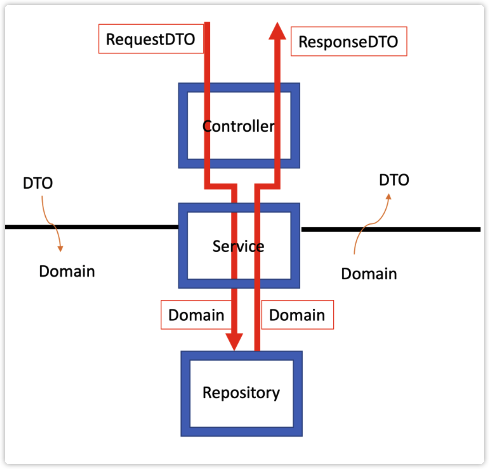
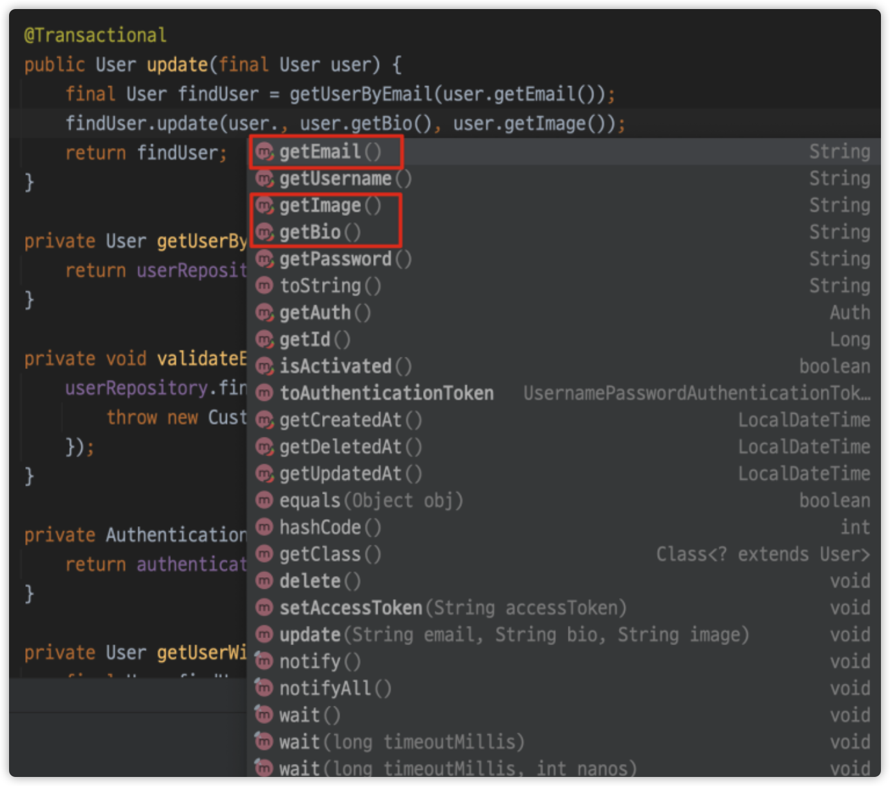

정답이 없는 이 주제에 대해 다양한 의견을 듣곤 했었는데, 저도 스스로 생각을 정리할 겸 작성해보려고 합니다. 주관적인 생각이 가득한 글이니 가볍게 읽어주세요.

- DTO의 역할은 무엇인가?

> Data Transfer Object

클라이언트 요청에 담긴 데이터를 서버에 전달하고, 서버측의 결과를 클라이언트 응답으로 전달하는 역할을 합니다.

하지만, 비즈니스 로직은 도메인 위주로 흘러가게 되고, 비즈니스 로직의 최종 결과만 다시 DTO로 Wrapping하여 응답하고는 합니다.

요청으로 받은 데이터(RequestDTO)를 어느 Layer에서 도메인 객체로 변환하고, 또 어느 Layer에서 결과값을 ResponseDTO로 변환하는 것이 좋을까요?

> 데이터 처리 흐름

우리는 Client로 부터, 입력 데이터를 받아서, 이를 도메인으로 변환하고 비즈니스 로직을 태우고, 그 결과를 다시 Client에게 보여줄 출력 데이터를 반환합니다.


DTO는 앞서 클라이언트 요청에 담긴 데이터를 서버에 전달하고, 서버측의 결과를 클라이언트 응답으로 전달하는 역할을 한다고 했습니다.

DTO를 Controller까지만 사용할 지, Service까지 사용할 지,

반대로 해석하면 Domain을 Controller까지 노출할 지, Service까지만 노출할 지를 결정해야합니다.

> DTO -> Domain, Domain -> DTO 변환

출처 입력

이에 대해 크게 2가지 의견이 있습니다.

> ## 1. Controller Layer에서 변환하자
>
> 

1. 클라이언트로부터 받은 데이터인 DTO를 비영속상태의 도메인 객체로 변환하여 서비스로 넘김.

2. 서비스에서는 비영속상태의 도메인을 받아서, 영속화하여 비즈니스 로직을 처리한다.

3. Service에서 domain을 리턴하고 controller에서 Domain -> DTO로 변환하여 클라이언트에 응답.

> ## 2. Service Layer에서 변환하자



1. 클라이언트로부터 받은 데이터인 DTO를 그대로 서비스로 넘김.

2. 서비스에서는 DTO -> Domain으로 변환하고 비즈니스 로직을 처리한다.

3. 처리가 끝난 결과 값을 Service에서 Domain -> DTO로 변환하여 컨트롤러에 응답하고, 컨트롤러는 ResponseEntity의 body에 결과값을 담아 클라이언트에 응답.

---

서론이 끝났으니, 이제 제 생각을 이야기해보자면, 저는 2번을 좀 더 선호하는 편입니다.

즉, 서비스 레이어에서 DTO 변환을 하는 것이 더 좋다고 생각합니다.

다음과 같은 필드를 가진 User 엔티티가 있다고 가정하겠습니다.

```java
@Getter
@Entity
@NoArgsConstructor(access = AccessLevel.PROTECTED)
@Table(name = "USERS")
public class User extends BaseEntity {
@Id
@GeneratedValue(strategy = GenerationType.IDENTITY)
@Column(name = "user_id")
private Long id;

    @Column(name = "email")
    private String email;

    @Column(name = "username")
    private String username;

    @Column(name = "password")
    private String password;

    @Column(name = "bio")
    private String bio;

    @Column(name = "image")
    private String image;

    @Column(name = "activated")
    private boolean activated = true;

    @Transient
    private Auth auth;

    ...
}
```

> ## Controller에서 변환할 때

사용자에게서 받은 데이터를 비영속 상태의 도메인으로 컨트롤러에서 변환하여 서비스로 넘기는 상황을 가정해보겠습니다.

예를 들어, Update를 하는 상황에서 email, bio, image를 변경할 수 있다고 한다면, 다음과 같이 DTO 클래스 내에 비영속 상태의 엔티티로 변경하는 메서드를 두어 Service Layer로 넘겨줄 것입니다.

```java
public User toEntity() {
    return User.builder()
                .email(email)
                .bio(bio)
                .image(image)
                .build();
}
```

이를 받아서 처리하는 Service 입장을 생각해보겠습니다.



- 사용하는 것은 3개의 필드인데, 값이 없는 다른 필드까지 갖고 있다.

이렇게 되면, 비즈니스 로직이 조금 복잡해진다면 비영속상태의 도메인과, 영속상태의 도메인을 잘못 사용할 수 있는 문제도 있어보입니다. 비영속상태의 도메인인 Parameter로 넘긴 user는 3개의 필드 이외에는 비어있는 객체이고, findUser로 찾은 영속상태의 도메인은 실제 모든 값들이 채워진 객체입니다. 같은 도메인 타입을 갖고 있기 때문에 개발자의 실수가 생길 수 있는 여지가 있다고 봅니다.

User 엔티티를 그대로 반환하는 상황을 보겠습니다.

```java
@Transactional
public User update(final User user) {
    final User findUser = getUserByEmail(user.getEmail());
    findUser.update(user.getEmail(), user.getBio(), user.getImage());
    return findUser;
}
```

Dirty Check로 Entity를 업데이트하고, 해당 Entity를 반환합니다.

이를 받는 Controller Layer에서 Dto를 생성하여 리턴하게 됩니다.

```java
@PutMapping("/user")
public ResponseEntity<UserInfo> update(@RequestBody final UpdateDto updateDto) {
    final User user = userService.update(updateDto.toEntity());
    return ok(UserInfo.create(user));
}
```

그 UserInfo는 다음과 같습니다.

```java
@Getter
@AllArgsConstructor(access = AccessLevel.PRIVATE)
@Builder(access = AccessLevel.PRIVATE)
public class UserInfo {
    private String email;
    private String username;
    private String bio;
    private String image;

    public static UserInfo create(final User user) {
        return builder()
                .email(user.getEmail())
                .username(user.getUsername())
                .bio(user.getBio())
                .image(user.getImage())
                .build();
    }
}
```

**보여줄 정보 스펙이 정해져 있는데(UserInfo), 굳이 더 많은 정보들을 갖고 있는 도메인 객체(User)를 컨트롤러 레이어까지 가져오는 것이 왜 좋은건지? 잘 모르겠습니다.** 오히려 보여주지 않아도 되는 정보(Password 등)가 Controller까지 노출되는 것이 더 좋지 않다고 생각합니다. 또한 ResponseDTO로 반환하는 값이 항상 하나의 엔티티에서만 정보를 추출하여 반환하는 것도 아닙니다. 다양한 상황에선 여러 엔티티의 값들을 조합하여 반환할 수도 있습니다. 연관관계에 있는 것들은 그래프 탐색으로 찾아오면 되기는 하지만, 그것도 OSIV가 켜져있다면 가능하나, 꺼져있다면 Controller에서 Lazy Query는 불가능해지게 됩니다. 상황에 따라 적용할 수 있는지가 결정되므로, 그리 좋은 방법은 아닌 것 같다고 생각합니다.

즉, 과연 Domain 계층이 Controller Layer까지 노출되는 것이 좋은 것인가? 에 대한 생각이 듭니다.

저는 Domain 계층은 Service Layer까지만 노출되는 것이 좋다고 생각합니다.

Client와 Domain간의 데이터를 주고 받는데 있어서 DTO가 존재한다고 생각합니다.

그렇기에, 도메인 계층을 Controller까지 가져오는 것은 제 스타일은 아닙니다.

물론, 지금까지 말한 도메인은 DDD로 설계된 엔티티가 아닌 위에 예시로 보여드린 평범 그 자체의 도메인을 의미합니다. 지금은 DTO 변환 시점을 이야기 하는 것이므로 논외로 하겠습니다.

Service에서 변환할 때

출처 입력

저는 2번째 방법인 Service에서 DTO를 변환하는 것을 찬성을 했는데, 기존의 예시와 동일하게 Update를 한다고 가정을 해보겠습니다.

우선 요청받은 dto를 service로 그대로 넘기게 되는데, Input 값이었던 UpdateDto에 대해서만 확인할 수 있습니다.

@Transactional
public UserInfo update(final UpdateDto dto) {
final User findUser = getUserByEmail(dto.getEmail());
findUser.update(dto.getEmail(), dto.getBio(), dto.getImage());
return UserInfo.create(findUser);
}
내용을 입력하세요.

대표사진 삭제
입력받은 email, image, bio 외는 확인할 수 없습니다.

그로인해 dto로 받은 인자로, 도메인을 가져오고 해당 엔티티를 더티체킹으로 업데이트하면 됩니다.

dto는 entity와 타입이 다르기 때문에 이전에 봤던 domain 객체 2개가 혼용되는 일은 적어집니다.

또한 Service는 Repository를 주입받으므로, Domain을 바로 찾아올 수 있습니다.

즉, DTO의 정보로 Domain을 찾아오는 데 유리합니다. 이 값은 트랜잭션 내에서 영속화됩니다.

즉, Repository는 도메인에 가깝고, Controller는 DTO에 가깝습니다.

이들 중간에 존재하는 Service Layer에서 변환 작업을 하는 것이 좋아보입니다.

그리고 반환 스펙도 Service에서 처리하면 됩니다.

이를 받은 Controller는 ResponseEntity의 body에 담아 클라이언트에게 응답하면 끝입니다.

@PutMapping("/user")
public ResponseEntity<UserInfo> update(@RequestBody @Valid final UpdateDto updateDto) {
return ok(userService.update(updateDto));
}
내용을 입력하세요.

이렇게 되면 다음과 같이 범위가 명확해집니다.

Domain : Repository~Service

DTO : Service~Controller

물론 Repository Layer에서 극한의 최적화를 위해 DB에서 Logic 처리를 하고 필요한 필드로만 구성하여 DTO로 바로 받는 방법도 있습니다. 지금은 Entity를 가져와서 Application 단에서 DTO로 변환하는 일반적인 상황을 가정하겠습니다.

제가 생각하는 장점은 이 뿐만이 아닙니다. 다시 처음으로 돌아가겠습니다.

대표사진 삭제
사진 설명을 입력하세요.

이 그림을 이렇게 표현해보겠습니다.

대표사진 삭제
사진 설명을 입력하세요.

1. "사용자의 정상적인 요청에 서버는 정상적인 응답을 한다."

그렇다면 다음은 어떤가요?

2. "사용자의 이상한 요청에 서버는 정상적인 응답을 한다."(서버 : "님, 요청 이상함. 확인해보셈")

3. "사용자의 정상적인 요청에 서버는 이상한 응답을 한다."(서버 : "#$^%%#@%" )

우리는 HTTP API를 기반으로 통신하고 있기 때문에, 이에 대한 HttpStatus Code가 존재합니다.

1. 정상적인 응답 : 2xx

2. 사용자측 에러 : 4xx

3. 서버측 에러 : 5xx

사용자가 요청을 보냈을 때 무한 대기 현상에 빠지지 않게 응답은 무조건 오도록 설계합니다.

그런데 받은 응답이 4xx 라면 그럼 클라이언트 측에서 '아, 내가 잘못 요청했구나' 를 알아차리고, 받은 응답이 5xx 라면 '서버가 맛이 갔네' 하고 알아차릴 수 있게 됩니다.

대표사진 삭제
사진 설명을 입력하세요.

로그인을 해야하는 상황입니다.

email 형식을 입력해야 하는데, "DolphaGo" 라고만 입력했습니다.

이건 사용자 측의 에러가 되겠죠? 4xx 에러를 내야합니다.

이와 같이, 사용자 측의 잘못인지, 서버측의 잘못인지의 검증을 가장 최상단에서 할 수 있습니다.

요청흐름은 DispatcherServlet -> RequestMappingHandlerMapping -> RequestMappingHandlerAdapter -> (ArgumentResolver) -> 컨트롤러(Handler) -> 서비스 -> 리포지토리... (필터, 인터셉터 제외) 가 되는데요.

지금 주제에선 컨트롤러가 요청을 가장 빨리 받습니다.

미리 사용자의 요청과 함께 제공된 정보들이 유효한지 검증하고, 유효하다면 비즈니스 로직으로 가져가는 겁니다. 이를 쉽게 해주는 것이 바로 Bean Validation입니다.

대표사진 삭제
사진 설명을 입력하세요.

@Valid를 통해 요청과 함께 제공된 정보를 검증하게 되는데, 다음과 같이 email은 Email 형식을 따라야 하고(@Email), null이거나 "" 빈 문자열이거나, " " 공백만 있는 문자열은 허용하지 않습니다.(@NotBlank)

대표사진 삭제
사진 설명을 입력하세요.

이에 대한 테스트를 해보면 다음과 같습니다.

대표사진 삭제
사진 설명을 입력하세요.

잘못된 값을 요청했을 때 로그는 다음과 같습니다.

Resolved [org.springframework.web.bind.MethodArgumentNotValidException: Validation failed for argument [0] in public org.springframework.http.ResponseEntity<com.study.realworld.user.controller.dto.response.UserInfo> com.study.realworld.user.controller.UserController.login(com.study.realworld.user.controller.dto.request.LoginDto): [Field error in object 'loginDto' on field 'password': rejected value [null]; codes [NotBlank.loginDto.password,NotBlank.password,NotBlank.java.lang.String,NotBlank]; arguments [org.springframework.context.support.DefaultMessageSourceResolvable: codes [loginDto.password,password]; arguments []; default message [password]]; default message [must not be blank]] ]
내용을 입력하세요.
필수 정보, 제대로된 정보인지 검증하고 나서 비즈니스 로직이 있는 Service 계층 아래로 내려보내도록 하는 것입니다. 만약 Validation을 통과하지 못할 때는 BindException을 던지고, 이를 BindResult에서 4xx 에러로 반환이 됩니다. 그래서 위의 테스트에서 isBadRequest() = 400 에러를 의미합니다.

"Service끼리 메서드를 호출할 수도 있지 않나요? 그럼 Service 끼리 호출할 때도 해당 DTO의 Format에 맞춰서 호출해야하잖아요."

넵, 맞습니다. 저는 그런 상황에서는 오버로딩을 통해 해결합니다.

만약 DTO를 받는 메서드에서 로직에 활용하는 정보를 해당 도메인이 이미 갖고 있다면, Domain객체를 또다시 Query해야 하는 비효율이 발생하기에 이때는 Domain을 얻고 난 이후의 로직만 작성하면 된다고 생각합니다. 그 Domain을 얻고난 이후의 로직도 함수화하는 것이 더 좋겠죠.

그게 아니라면 도메인을 DTO로 컨버팅 후에 로직을 재활용합니다.

public UserInfo login(final User user) {
return login(LoginDto.create(user.getEmail(), user.getPassword()));
}

public UserInfo login(final LoginDto loginDto) {
final Authentication authentication = authenticate(loginDto.toAuthenticationToken());
final TokenDto token = tokenProvider.createToken(authentication);
return UserInfo.create(getUserWithTokenByEmail(loginDto.getEmail(), token.getAccessToken()));
}
내용을 입력하세요.
물론 이런 과정이 필요없는 Domain in / Domain out 메서드에 비해 추가적인 공수가 든다는 것은 단점입니다.

인자가 몇개 안될 때 매개변수로 넘기는 방식도 있습니다.

하지만 데이터는 클래스로 따로 관리해야 한다. 등등 의견이 분분하기도 합니다.

public UserInfo login(final String email, final String password) {
// ...
}
내용을 입력하세요.

la fin de l'article

글의 마지막

이는 관점 차이가 분명히 존재하는 주제입니다.

저는 실제 비즈니스 로직은 서비스 레이어부터 시작하고, 컨트롤러는 클라이언트로부터 요청을 받고 결과를 응답하는 역할이라고 생각해서 위와 같은 글을 썼습니다.

컨트롤러는 다음과 같은 역할을 한다고 생각합니다.

1. 요청을 받아서 특정 비즈니스 로직이 있는 서비스를 호출

2. 해당 서비스의 결과값을 클라이언트에게 응답

모두 서비스 레이어부터 실제 비즈니스 로직이 시행됨은 대부분이 동의하는 바입니다.

다시 말해 이 주제는, 비즈니스 로직에서는 도메인을 다루기 때문에, 사용자에게서 받은 입력과 사용자에게 보여지는 출력을 전처리/후처리하는 Layer에 대한 의견이 갈리는 것입니다.

저는 전처리(dto + repository로 영속화된 도메인 객체를 얻는 과정)/후처리(controller에는 보여질 데이터만 제공하면 됨)도 비즈니스 로직으로 포함하는 것이라고 생각하는 것이며, 컨트롤러에서 변환하는 분들의 의견은 전처리/후처리는 컨트롤러에서 해도 되고, 실제 비즈니스 로직을 다루는 서비스부터는 도메인만 다루자는 것입니다.

의견이 갈리는 주제입니다.

본인이 편한 것을 사용하시면 됩니다.

팀 컨벤션을 따르는 것도 한 방법입니다.

긴 글 읽어주셔서 감사합니다.

피드백은 언제나 환영입니다.

ogq_57172f8181a7f-16
